# k8sPodPCP — Kubernetes Pod Power and Energy Prediction

[badges: License | Build CI | Release | DOI | Docs | Coverage]

Predict energy/power for Kubernetes workloads from their specs. This repo collects workload templates, encodes them into features, trains a simple KNN regressor, and serves predictions via a FastAPI service. It integrates with Kepler and Prometheus to build ground-truth labels and can run end-to-end on Kubernetes.

## ✨ Features

- **Kubernetes watcher**: Streams `Deployment`/`Job`/`CronJob`/`Pod` specs to structured `InferenceRequest` JSON
- **Feature encoder**: SBERT-optional text embeddings + numeric/categorical features → Parquet with vectors
- **Label builder (Kepler/Prometheus)**: Exports `avg_power_w` and `energy_step_j`/`total_energy_j` labels
- **Training**: KNN baseline with group-aware cross-validation; saves `.joblib` model
- **Serving**: FastAPI `POST /predict` endpoint that returns predicted energy for a workload spec
- **Kubernetes manifests**: Jobs for collect→encode→label→join→train and Deployments for API + collector

## 🧱 Architecture

```mermaid
flowchart TD
  subgraph Cluster
    Collector[Collector
    k8s_collect.py] -->|POST InferenceRequest| API[
    FastAPI: /predict]
    API --> |uses| Encoder[(encoder.joblib)]
    API --> |uses| Model[(knn_energy.joblib)]
    Kepler[(Kepler)] -->|metrics| Prometheus[(Prometheus)]
  end
  Jobs[Batch Jobs
  collect→encode→label→join→train] -->|artifacts| PVC[(podpower-data PVC)]
  API --> PVC
  Collector --> PVC
```



## 🚀 Quickstart

### Prerequisites

- Python ≥ 3.11
- Access to a Kubernetes cluster (optional for local dev)
- Prometheus + Kepler for label generation (see `kepler.md` and `prometheus.md`)
- Docker (optional) and `kubectl`/`helm` if deploying to Kubernetes

### Local Install

```bash
python -m venv .venv && source .venv/bin/activate
pip install -r requirements.txt
```

### Run API locally

```bash
# from repo root
uvicorn app/predict_service:app --host 0.0.0.0 --port 8000
# open http://localhost:8000/docs
```

### FastAPI endpoints (app/predict_service.py)

- **POST `/predict`**: Accepts an `InferenceRequest` JSON (same schema produced by `app/k8s_collect.py`) and returns a `PredictOut` with `pred_energy_step_j` and metadata.
- **POST `/infer/from-yaml`**: Accepts Kubernetes YAML (`Content-Type: text/plain`) for `Deployment`/`Job`/`CronJob` and returns the derived `InferenceRequest` JSON(s).
- **POST `/predict/from-yaml`**: Accepts Kubernetes YAML (`Content-Type: text/plain`) and returns a `PredictOut` directly.

Service auto-loads artifacts at startup using env vars:

- `ENCODER_PATH` (default: `/artifacts/encoder.joblib`)
- `MODEL_PATH` (default: `/artifacts/knn_energy.joblib`)

Swagger UI is available at `/docs` and OpenAPI JSON at `/openapi.json`.

### Local CLI workflow (collect → encode → label → join → train → predict)

```bash
# 1) Collect workload templates to NDJSON (from your current cluster)
python app/k8s_collect.py watch \
  --kinds Deployment Job CronJob Pod \
  --emit-initial \
  --suppress-tls-warnings \
  --output data/in.ndjson

# 2) Fit encoder (disable SBERT initially for speed)
python app/k8s_encode.py fit \
  --input data/in.ndjson \
  --out artifacts/encoder.joblib \
  --no-sbert

# 3) Transform features
python app/k8s_encode.py transform \
  --input data/in.ndjson \
  --encoder artifacts/encoder.joblib \
  --out data/features.parquet

# 4) Export labels from Kepler/Prometheus (job-level aggregation window)
python app/kepler_labels.py \
  --prom http://prometheus-kube-prometheus-prometheus.monitoring.svc.cluster.local:9090 \
  --mode job \
  --start $(date -u -d '6 hours ago' +%s) \
  --end   $(date -u +%s) \
  --out data/labels.parquet

# 5) Join features ↔ labels
python app/join_features_labels.py \
  --features data/features.parquet \
  --labels   data/labels.parquet \
  --out      data/train_rows.parquet

# 6) Train KNN model (total energy as target)
python app/train_power.py \
  --train data/train_rows.parquet \
  --target total_energy_j \
  --out artifacts/knn_energy.joblib

# 7) Predict offline for current workloads
python app/predict_k8s.py \
  --encoder artifacts/encoder.joblib \
  --model   artifacts/knn_energy.joblib \
  --input   data/in.ndjson
```

### Docker

```bash
docker build -t k8spodpcp:latest .

# Run API (override image CMD to start uvicorn)
docker run --rm -p 8000:8000 \
  -e ENCODER_PATH=/app/artifacts/encoder.joblib \
  -e MODEL_PATH=/app/artifacts/knn_energy.joblib \
  -v "$(pwd)/app/artifacts:/app/artifacts:ro" \
  k8spodpcp:latest \
  uvicorn app/predict_service:app --host 0.0.0.0 --port 8000
```

### Kubernetes

Install Prometheus and Kepler first (see `prometheus.md` and `kepler.md`). Then run the training pipeline jobs and deploy the services:

```bash
# Namespace + PVC
kubectl apply -f k8s/jobs/00-ns-pvc.yaml
# Maybe need to update storage class to local-path or

# RBAC for reading cluster objects
kubectl apply -f k8s/jobs/01-rbac.yaml

# Job 1: collect + encode
kubectl apply -f k8s/jobs/02-job1-collect.yaml

# Job 2: build labels from Kepler
kubectl apply -f k8s/jobs/03-job2-label.yaml
# maybe need to update the prometheus endpoint


# Job 3: join features and labels
kubectl apply -f k8s/jobs/04-job3-dataset.yaml

# Job 4: train model
kubectl apply -f k8s/jobs/05-job4-train.yaml

# Deploy predictor API (Service + optional Ingress)
kubectl apply -f k8s/deploy-podpower-predict.yaml

# Deploy collector (watches cluster and optionally POSTs to API)
kubectl apply -f k8s/deploy-podpower-collector.yaml
```

#### Example: CronJob that periodically pre-scores a Deployment

Use a `CronJob` to predict energy for an existing Deployment on a schedule by piping the live manifest into the API. Ensure the Service name (`podpower-predict` below) matches your install, and the ServiceAccount has RBAC to read the target resource.

```yaml
apiVersion: batch/v1
kind: CronJob
metadata:
  name: podpower-prescore
  namespace: default
spec:
  schedule: "*/10 * * * *"  # every 10 minutes
  jobTemplate:
    spec:
      template:
        spec:
          serviceAccountName: podpower-reader
          restartPolicy: OnFailure
          containers:
          - name: prescore
            image: bitnami/kubectl:1.29
            command: ["/bin/sh","-c"]
            args:
            - |
              DEPLOY=nginx-deployment
              NS=default
              kubectl get deploy ${DEPLOY} -n ${NS} -o yaml | \
              curl -sS -X POST http://podpower-predict.default.svc.cluster.local:8000/predict/from-yaml \
                -H 'Content-Type: text/plain' --data-binary @- | jq .
```

Notes:

- Replace `podpower-predict.default.svc.cluster.local:8000` with your Service DNS/port.
- Create a minimal RBAC allowing `get` on `deployments` in the target namespace for `podpower-reader`.

## ⚙️ Configuration

| Variable       | Default                         | Description                                  |
| -------------- | -------------------------------- | -------------------------------------------- |
| `ENCODER_PATH` | `/artifacts/encoder.joblib`      | Encoder artifact path (service default)       |
| `MODEL_PATH`   | `/artifacts/knn_energy.joblib`   | Trained model path (service default)          |
| `KUBECONFIG`   | autodetect                       | Path for out-of-cluster k8s client (collector) |
| `K8S_CA_FILE`  | empty                            | CA file path for TLS (collector)              |
| `VERIFY_SSL`   | client default                   | Force SSL verify on/off (collector)           |

Notes:
- In Kubernetes, the manifests mount a PVC at `/app/artifacts` and set env vars to use `/app/artifacts/*.joblib`.
- The FastAPI service loads artifacts at startup; ensure the PVC contains the trained files.

## 📚 Usage Examples

- **HTTP API**

```bash
curl -s http://localhost:8000/predict \
  -H 'Content-Type: application/json' \
  -d @sample.json | jq .
```

- **Collector from a YAML file**

```bash
python app/k8s_collect.py from-file ./example/example.yaml
```

- **Prometheus / Kepler sanity checks**
  - Ensure Prom has data for: `kube_pod_owner`, `kepler_container_power_watt`, `kepler_container_joules_total`

- **Python (use in schedulers/workflows)**

  ```python
  import requests

  # Predict directly from a Kubernetes YAML manifest
  yaml_text = open("example/example.yaml", "r", encoding="utf-8").read()
  r = requests.post(
      "http://localhost:8000/predict/from-yaml",
      data=yaml_text,
      headers={"Content-Type": "text/plain"},
      timeout=30,
  )
  r.raise_for_status()
  print(r.json())  # {'pred_energy_step_j': ..., 'workload_kind': 'Deployment', ...}

  # Or send an InferenceRequest JSON directly to /predict
  ir = {
      # Minimal example; prefer generating with app/k8s_collect.py
      "workload_kind": "Deployment",
      "workload_name": "nginx",
      "namespace": "default",
      "pod_spec": {
          "containers": [{"name": "nginx", "image": "nginx:1.25"}]
      }
  }
  r2 = requests.post(
      "http://localhost:8000/predict",
      json=ir,
      timeout=30,
  )
  r2.raise_for_status()
  print(r2.json())
  ```

- **Response shape**

  ```json
  {
    "pred_energy_step_j": 123.4,
    "workload_kind": "Deployment",
    "workload_name": "nginx",
    "namespace": "default",
    "spec_hash": "6c7c..."
  }
  ```

## 🧪 Testing & Quality

> **TODO:** Add tests and CI. Suggested commands once added:
> `pytest -q`, `ruff check .`, `black --check .`

## 🗺️ Roadmap

- Add validation datasets and benchmarks
- Optional mutating webhook to annotate workloads with predicted power
- Model registry and automated retraining

## 🤝 Contributing

Contributions are welcome. Please open an issue to discuss major changes.

## 🔐 Security

Please report vulnerabilities via a private issue.

## 🧾 License

> **TODO:** Add a `LICENSE` file (recommended: Apache-2.0 or MIT).

## 📝 Cite Us

> **DOI:** `TODO`

```bibtex
@misc{K8sPodPCP2025,
  title = {k8sPodPCP: Kubernetes Pod Power and Energy Prediction},
  author = {TODO},
  year = {2025},
  doi = {TODO}
}
```

## 🙏 Acknowledgments

- Kepler (`sustainable-computing-io/kepler`)
- Prometheus & kube-prometheus-stack

## 📬 Contact

`<CONTACT_NAME>` — `<EMAIL>`

## 📦 Additional Artifacts

- `kepler.md`: Helm install commands for Kepler
- `prometheus.md`: Helm install commands for kube-prometheus-stack
- `example/example.yaml`: Sample K8s manifest for local tryouts

